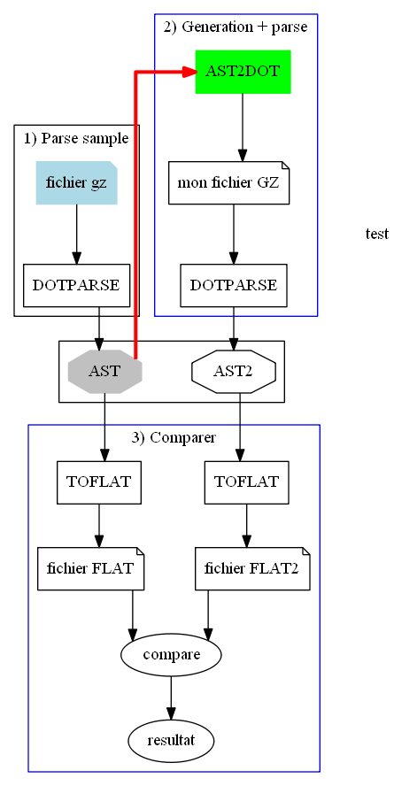

# AST2DOT
Convert graphviz AST to DOT.

When you use Graphviz you create a .dot file.
You can parse a .dot file to an AST tree with "dotparser".
The AST tree can be modified with javascript's function, like add a node.

I build a program witch revert the processus.
You create a new .dot file from the AST tree.

To do a good job :

The challenge is to parse a dot file, create an AST tree and build the .dot file again from the AST tree.
I compare the primary .dot file with the new one.

I take many representative .dot file.

Now, i try to 
* add new function in the AST tree.

** remove a node

** add a node

* add interractive svg function
* improve the graphviz table parse.

Release
-----------------

**22/08/2019**

Release 0.4.1

Improve tests and documentation

**06/02/2019**

First release 0.4.0

Test
-----------------
You need use jasmine
in the root :
>jasmine
